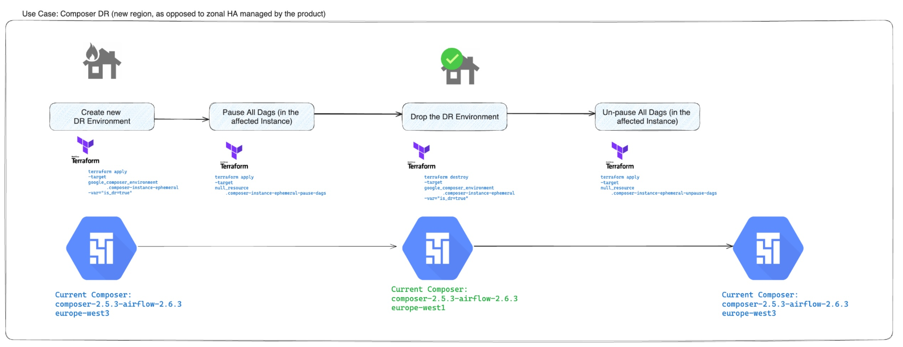
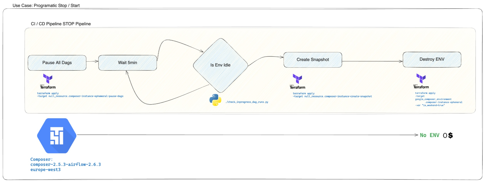
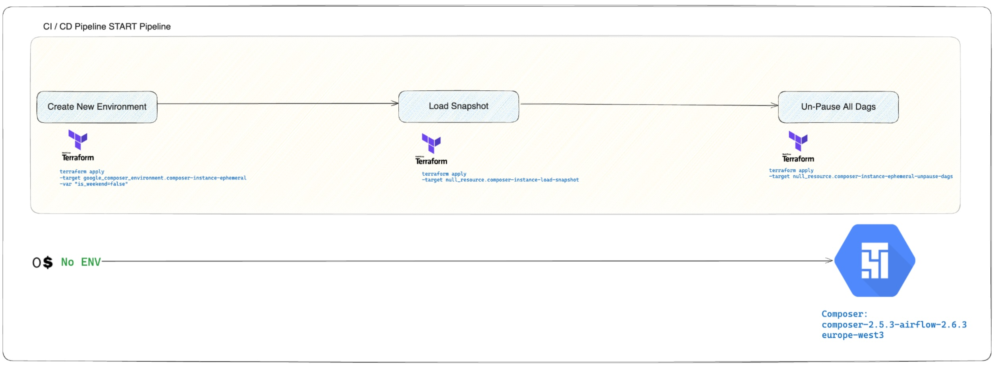

## PSO Composer Ops

This repository provides tools and scripts to manage Cloud Composer environments, focusing on operational tasks such as starting/stopping environments and disaster recovery (DR).

**Key Features:**

* **Environment Control:** Start and stop Composer environments to manage costs and availability.
* **Disaster Recovery:** Create and restore snapshots for quick recovery in case of failures or regional outages.
* **DAG Management:** Pause and unpause all DAGs within an environment for maintenance or updates.

**Before running Terraform:**

1. **Create a `terraform.tfvars` file:**
    * Copy the `terraform.tfvars.example` file to `terraform.tfvars`.
    * Replace the placeholder values in `terraform.tfvars` with your client-specific values.
    * **Important:** Pay close attention to the `composer_config` block and ensure the settings are appropriate for your needs.
2. **Set the GOOGLE_IMPERSONATE_SERVICE_ACCOUNT environment variable:**
    ```bash
    export GOOGLE_IMPERSONATE_SERVICE_ACCOUNT=YOUR_SERVICE_ACCOUNT@YOUR_PROJECT.iam.gserviceaccount.com
    ```
3. **Configure the provider:**
    * **Replace placeholders in `provider.tf`:**
        * Replace `BILLING_PROJECT_ID` with your Google Cloud project ID used for Billing
        * Replace `TERRAFORM_SA_EMAIL` with the email address of the service account you want to impersonate.
4. **Configure the backend state bucket:**
    * **Replace placeholders in `backend.tf`:**
        * Replace `STATE_BUCKET` with your Google Cloud state bucket
        * Replace `PREFIX` with an application specific prefix.


**To deploy:**

1. **Initialize Terraform:**
    ```bash
    terraform init
    ```
2. **Plan the deployment:**
    ```bash
    terraform plan
    ```
3. **Apply the deployment:**
    ```bash
    terraform apply
    ```

**Using the Operational Scripts:**

**Disaster Recovery**

The `composer_snapshot_manager.sh` script facilitates disaster recovery by enabling you to create and restore snapshots of your Composer environments. This ensures business continuity in case of unexpected failures or regional outages.

Here's a visual representation of the DR process:

**Start and Stop**

You can control the availability and cost of your Composer environments by using the `toggle_all_dags_primary.sh` script to start and stop them as needed.

The following diagrams illustrate the start and stop process:


This repository includes several scripts to help you manage your Composer environments:

* **`composer_snapshot_manager.sh`:** This script allows you to create and restore snapshots of your Composer environments. This is crucial for disaster recovery and ensuring business continuity.
    * **To create a snapshot:**
        ```bash
      ./composer_snapshot_manager.sh --project <PROJECT_ID> --environment <ENVIRONMENT_NAME> --location <LOCATION> --snapshot_bucket <BUCKET_NAME> --operation create
        ```
    * **To restore a snapshot:**
        ```bash
      ./composer_snapshot_manager.sh --project <PROJECT_ID> --environment <ENVIRONMENT_NAME> --location <LOCATION> --snapshot_bucket <BUCKET_NAME> --operation restore
        ```
* **`toggle_all_dags_primary.sh`:** This script enables you to pause or unpause all DAGs within a Composer environment. This can be useful for maintenance or when deploying updates.
    * **To pause all DAGs:**
        ```bash
      ./toggle_all_dags_primary.sh --project <PROJECT_ID> --environment <ENVIRONMENT_NAME> --location <LOCATION> --operation pause
        ```
    * **To unpause all DAGs:**
        ```bash
      ./toggle_all_dags_primary.sh --project <PROJECT_ID> --environment <ENVIRONMENT_NAME> --location <LOCATION> --operation unpause
        ```

**Additional Notes:**

* **Dependencies:** The scripts in this repository have dependencies that need to be installed. Refer to the `requirements.txt` file in the `scripts` directory for a list of dependencies and use `pip install -r requirements.txt` to install them.
* **Customization:** You can customize the scripts to fit your specific needs. For example, you can modify the `composer_config` block in the `terraform.tfvars` file to change the Composer environment configuration.
* **Security:** Ensure that the service account used for Terraform and the scripts has the necessary permissions to manage your Composer environments and related resources.